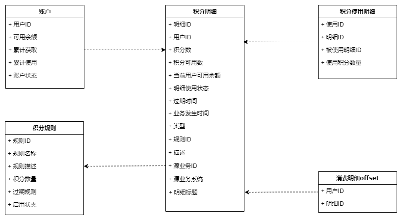
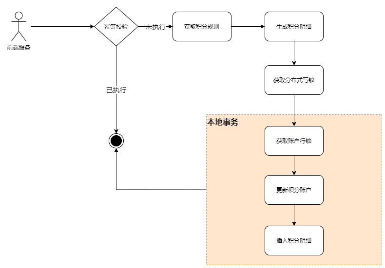
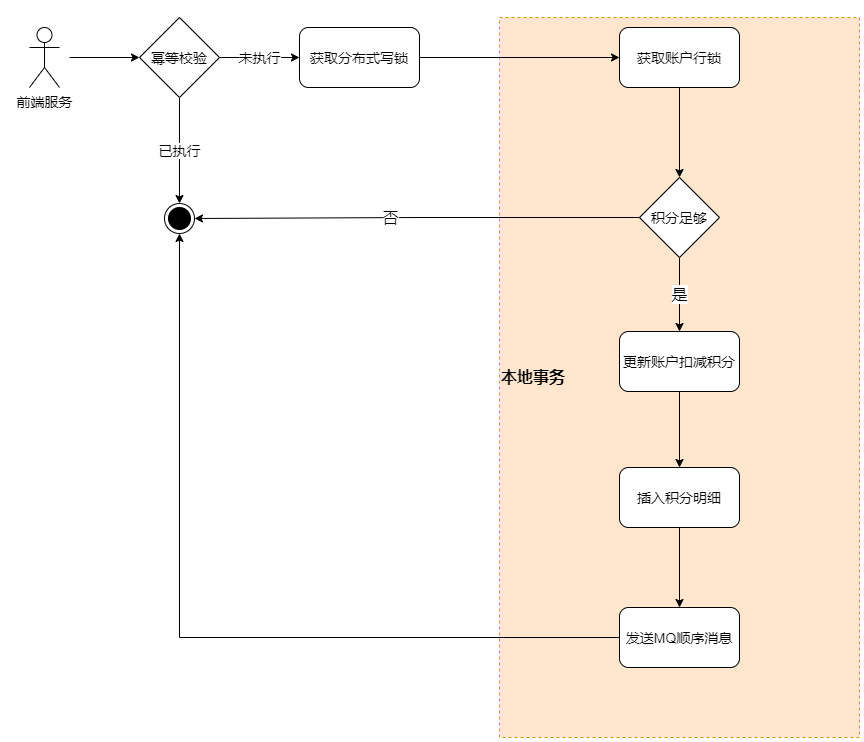
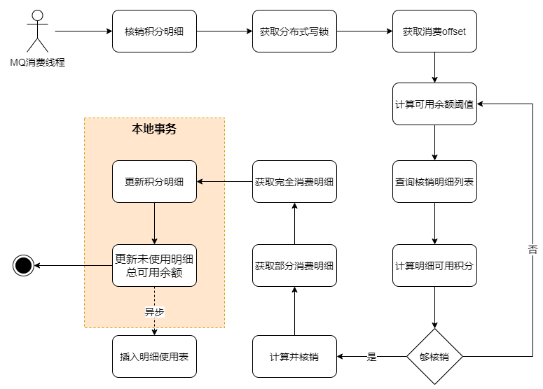
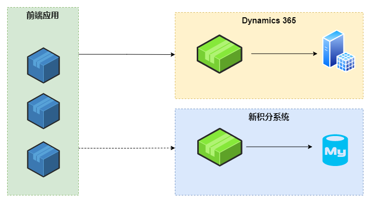
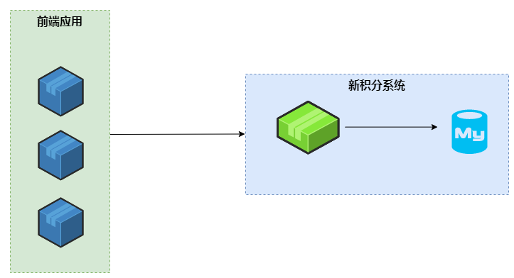

title: 积分系统设计与迁移
date: 2022-04-02 12:20:56
categories: [java]
tags: [系统重构]
---

# 积分系统设计与迁移

积分系统是用户运营的重要一环，借助积分的作用，可以提高用户粘性。对于初创品牌而言，通过积分奖励，促进建立用户品牌认可，也是非常重要的手段和方式。积分系统如果出故障或问题，会影响用户进行积分获取和变现，会造成非常严重的客诉。
积分系统有发放，消费，退还等操作，从系统要求和属性上来讲，比较接近支付系统，必须保证一致性、高性能、高可用。
由于历史原因，原有积分系统基于Microsoft Dynamics 365定制实施实现，在面对C端大流量和并发时，经常宕机，不仅可用性和性能不达标，最为致命的是一致性也无法保证，存在用户积分不准确的问题。经过分析后认为对Microsoft Dynamics 365进行重构陈本过高且不具有相关资源，只能重新实现积分系统。

## 系统设计

积分系统将作为一个通用的中台型服务，不直接对接用户，仅提供API给活动server，APP server等前端服务调用，调用权限仅限于内网集群有使用积分API的节点。积分系统作为微服务使用K8S进行集群部署。数据库与redis均使用云服务集群版本。因此，设计主要关注数据模型和实现逻辑上。

<!--- more --->

新积分系统模型设计如上图，积分账户用于记录积分的可用余额，获取总额，使用总额信息；积分明细用于记录用户获取，消费积分的信息；积分使用明细，用于记录用户在消费积分时，对应消耗了哪些积分明细；积分
规则，用于设置积分获取时创建积分明细的相关规则；消费明细offset，用于记录用户消费到哪一条积分明细。ID都使用自增无符号BIGINT型（按10亿用户算，单用户可用明细记录为184亿条，可能10年都已经够用）。

### 为什么要记录积分使用状态和明细以及offset？

业务要求，要类似ERP，有核销（即标注积分明细使用状态，分为未使用、部分使用、完全使用，下同）的逻辑。用户获取积分后，在消费时，需要标记用户消费积分对应的是哪些获取记录，且先获取先消费。在过期提醒时，需要知道哪些积分是获取后未使用却即将过期的，如果不标记积分使用状态和记录消费到什么位置，则无法满足业务条件，同时记录消费位置可以辅助对积分明细的核销。

### 积分发放，返还

积分发放和返还使用同一套逻辑。逻辑较为简单，如下图：

1. 进行幂等校验，通过业务系统全局流水号和业务系统标识，验证是否已执行过此业务。如果已执行，则直接返回；
2. 从请求参数中获取业务编码，根据业务编码获取对应的积分规则；
3. 根据积分规则，生成积分明细，包括积分数量，过期时间等等；
4. 获取积分账户的分布式写锁；
5. 获取积分账户数据库行锁；
6. 更新积分账户；
7. 插入积分明细。

上面的逻辑中，重点是保证积分账户的更新和明细的插入必须在同一个事务中。

### 积分消费

根据需求，积分消费主要由3个步骤，首先是对积分账户的更新，其次是对积分明细的核销，最后是记录已消费的明细。       

由于用户积分获取积分平均每条明细的积分值在5个积分以下，但是每次用户消费的积分平均最低为800积分左右，也就是说，平均每次消费，将产生1+1+800/5X2=322条数据的更新或插入：更新积分账户，新增使用明细，核销160条明细，新增160条使用明细。对数据的操作，实际情况其实只会更多，因为大量用户只通过签到任务赚取积分，每次只有2个积分。如果消费的3个步骤，放在同一个线程中执行，即使使用批量更新和插入，执行速度也差强人意，无法满足性能要求。这里使用的解决方法是通过MQ解耦账户的更新和明细的核销和记录。     
流程如下图:

1. 进行幂等校验，通过业务系统全局流水号和业务系统标识，验证是否已执行过此业务。如果已执行，则直接返回；
2. 获取账户分布式写锁；
3. 获取账户数据库行锁；
4. 判断积分是否足够消费，如果不够，直接返回；
5. 对积分账户余额进行扣减；
6. 新增一条使用明细；
7. 通过MQ发送一条积分消费顺序消息。

以上逻辑中，需要确保567步的执行在同一个事务中，如果其中一步失败需要回滚并返回失败。

### 积分明细核销和记录

积分明细核销，通过消费MQ积分消费消息实现。流程如下图：

1. MQ消费者调用核销明细服务。
2. 获取明细核销分布式写锁；
3. 获取上一次消费的位置（消费明细起始位置）；
4. 根据消费的积分数量，计算积分余额阈值（用于定位消费明细结束位置），方法是使用一个增长因子（默认1.1）乘以消费积分数；
5. 根据消费位置和积分余额阈值，查询核销明细列表；
6. 计算查询到的明细列表积分可用数总和；
7. 判断可用总数是否足够消费，如果不够，增长因子增大，跳转4执行；
8. 对明细列表中明细进行核销：积分可用数累加，未超过消费积分数的，算全使用，放入全使用列表，如果刚好累加超过消费积分数，进行拆分，计算出已使用的积分数并标记部分使用；
9. 从计算结果中获取部分使用的积分明细；
10. 从计算结果中获取全部使用的积分明细；
11. 批量更新积分明细表中完全使用的明细，单独更新部分使用的明细；
12. 更新未使用积分明细的当前用户可用余额；
13. 异步执行明细使用表记录插入，如果出错，记录日志并告警。

在上面的逻辑中，对数据库的操作在同一个事务中，插入使用明细只有在12以上步骤成功后才会执行。在这个业务流程中，只要其中一个步骤出错，均会返回消息消费失败，进行重新消费。

### 积分过期

积分过期，有2个方案：

> 方案1：每次用户查询积分时，进行过期处理。

> 方案2：每天午夜跑定时任务进行处理。

这里采用2个方案结合。

处理的逻辑都一致：
1. 检查用户当日是否已经处理过积分过期，如果处理过，直接结束；
2. 获取积分账户分布式写锁；
3. 查询用户过期积分明细列表；
4. 计算过期积分数量并生成过期积分明细；
5. 获取积分账户数据库行锁；
6. 更新积分账户并插入积分明细。

定时任务采用多节多分片的形式，首先根据分片查询出当前节点要处理的用户集合，再对用户执行积分过期操作。

## 设计总结

在设计时，考虑到积分所有数据，均是以用户为关联，同一个用户的数据，可以路由到同一个库同一个表中，所以即使以后进行分库分表，也能够避开分布式事务。整体来说，没有太大的难度。
主要进行以下优化：
1. 数据库操作能批量都批量。
2. 尽量最小化事务范围，减少长事务。
3. BASE模式，分支事务和主事务分离，分支事务不影响主事务，最终一致即可。
4. 积分规则缓存，使用常驻的方式。创建和更新数据库成功后，直接推送到缓存中，一般积分定了之后不会变更。
5. 各数据库表做索引优化。
6. 新API兼容老系统，出参入参尽量保持一致。

在选型时，考虑到运维资源问题，数据库，中间件等系统直接选择云厂商提供的云服务。使用的主要组件及系统：

* [SpringCloud](https://spring.io/projects/spring-cloud)
* [Redisson](https://redisson.org/)
* [MyBatis](https://mybatis.org/mybatis-3/zh/index.html)
* [ons-spring-boot-starter](https://github.com/DR-YangLong/ons-spring-boot-starter)
* [阿里云RDS](https://help.aliyun.com/document_detail/95798.html)
* [阿里云REDIS](https://help.aliyun.com/product/26340.html)
* [阿里云SchedulerX](https://help.aliyun.com/product/147760.html)
* [阿里云RocketMQ](https://help.aliyun.com/product/29530.html?spm=5176.234368.J_5253785160.5.f7d4241amK1LYl)

## 系统迁移

在完成积分系统重构的同时，还需要进行数据的迁移，原有数据由于程序问题，并且已经运行3年时间，存在严重的数据问题，最严重的的莫过于积分账户与积分明细中账不平，其次还有积分明细中当前用户可用余额及积分可用数不准确问题。因此在系统迁移之前，需要先对历史错误数据进行处理，然后才能进行系统迁移。

### 历史数据处理与迁移

历史数据的处理，通过代码走查，发现原Sql Server中类似用户积分账户表的数据相对准确，因此用户的积分余额以账户表中为准。

1. 处理积分积分明细记录中当前用户可用月及积分可用数不准确问题。

经过排查发现，原积分明细表中，只有当积分明细完全使用时，积分可用数才不准确，但当前用户可用余额，均不准确。因此，先根据积分明细的使用状态，将完全使用的积分明细中积分可用数和当前可用余额更新为0。然后，对用户部分使用和未使用的积分明细累计更新当前用户可用余额。

2. 处理积分账户和积分明细账不平问题。

先统计出账不平的数据，由于程序问题，这里有两种情况：1是用户积分账户里积分余额大于积分明细记录统计出的明细可用余额。2是用户积分账户里的积分余额小于积分明细记录统计出的明细可用余额。出现1的原因是前期给用户补发积分的时候，存在违规操作，直接对用户账户进行了更新，但未插入明细记录造成。而出现2的原因，是用户实际已经使用了积分，但由于原系统宕机，进行了重启（一直没有解决宕机问题，宕机后也仅重启就完事，关键日志未输出，也未对数据进行处理。），而原系统逻辑中，已使用的积分明细并没有使用批量更新，更严重的是在一条条更新时，循环外层没有开启事务，因此导致部分明细没有更新积分使用状态。2种情况的处理方法也不同，对于用户账户可用积分大于明细可用积分统计的情况，给相关用户在积分明细中新增一条积分差额的积分获取明细，并且设置这条明细用户不可见，但可用于消费；对于用户账户可用积分小于明细可用积分统计的情况，从前往后更新相应积分差额对应的积分明细为完全使用状态或部分使用状态。

以上处理过程，均通过大数据平台进行处理，处理后经验证数据问题已经解决，处理时间可控，在两个小时以内。数据迁移时，需要Dynamics 365积分相关服务停止服务进行迁移。

### 系统迁移

系统迁移主要分3个阶段：

1. 调用方进行改造，新增积分相关操作时调用新系统API。
2. 执行数据迁移，新系统上线与Dynamics 365并行运行。
3. 切换到新系统。

#### 原有调用方系统改造

原有的使用积分API相关的调用方，需要进行代码改造，在积分相关操作（获取积分，消费积分，返还积分，账户可用余额读取）时，如果调用Dynamics 365成功，需要异步进行新系统的相关API调用，并记录相关日志：在异步调用新系统的逻辑中，对比Dynamics 365和新系统的结果，如果不一致，需要记录日志到指定位置。
调用方在改造时，需要记录相关改造位置，输出清单。

经过排查，调用积分写相关API的系统有4个，改造工作量和风险较小。

#### 新老系统并行运行

在调用方系统改造完成后，进行停机数据迁移并上线新系统，此时如下图所示，新老积分系统并行运行。

在并行运行状态下，3天为一个周期，每个周期后验证用户积分两个系统之间是否一致，此时只验证积分账户中可用余额（如上文，Dynamics 365中积分明细处理有问题）如果不一致，分析并解决问题。直到持续5个周期无问题。

#### 切换到新系统

在新系统验证完成后，调用方根据之前输出的改造清单，对调用积分API的位置再次进行改造，去掉对新系统的异步调用，将Dynamics 365的调用全部替换为对新系统的调用，完成整个迁移工作。

## 迁移总结

迁移时有3个重要节点，需要中断服务：

* 数据迁移
* 调用方系统新增新系统调用改造上线
* 调用方系统只调用新系统改造上线

其中数据迁移服务停止时间最长。调用方系统上线时间由于持续集成平台支持，在测试完备的情况下，时间可控。

