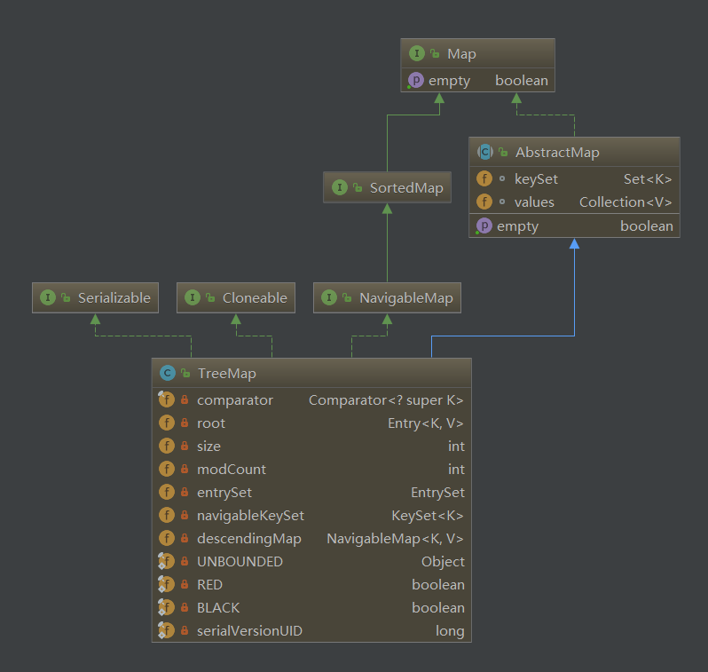

title: Map
date: 2017-04-19 19:40:56
categories: [java]
tags: [java]
---

# map
java实现的map采用散列表的方式，有2个要素构成：桶数组与散列函数。桶数组存储元素，散列函数则确定元素在桶中存放的位置。    
在散列表中，为得到较好的性能，需要使每个桶的容量都小于桶的数量，因而引入装载因子,设l为装载因子，n为每个桶的容量，N为桶数组的数量，则：
> l=n/N

```txt
map散列表结构解决碰撞的方法有：
设H为映射的Key通过散列函数计算得到的值，N桶数量（为存储映射的数组的length），L为装载因子=n(每个桶容量)/N。j为正整数（j=1,2,3...）。
1. 开放地址策略。采用开放地址策略的方式是使用数组本身来解决下标冲突，本质都是在遇到碰撞时，将后入的映射向后移动，此策略缺点是性能随元素的增加和碰撞概率（碰撞概率也随元素增加而上升）上升而下降，优点是节省空间，不需要借助额外的空间来解决冲突。线性探测法，遇到碰撞后执行(H+1)%N得到新的下标j，发现j已被占用，再执行(H+2)%N，如此，直到得到的下标能够存入数组。平方探测法，遇到冲突，使用循环(H + j^2)%N的方式直到元素能够存入数组。前2个方法在L大于0.5时，会造成大量元素集聚（线性连续集聚，平方二阶集聚），使得即使存在空桶，也有可能找不到插入的位置。双散列法，除原有散列函数外，再选取另外一个散列函数g()作为二阶散列函数，使得任意g(key)不为0，不断使用H + j*g(key)获取新下标，直到能够存入元素。
2. 分离链策略。分离链策略是将冲突的元素使用链表的形势存储在同一个数组下标处，形成一个列表数据结构，对映射的操作转变为对列表的操作。这种策略下的方法叫做链地址法。此策略缺点是需要额外的空间存储链表，优点是性能稳定且较高。
```
map存储键值对，有的map允许null值key和value，有的不允许。存取value时通过key判断取值，会涉及key对象的2个方法，equals和hashCode。如果使用重写equals和hashCode方法的类实例化的对象作为key时需要注意可能导致映射不正确（不同的对象会被当成一个对象处理）。如果使用可变对象（修改对象属性值时会对equals产生影响）作为key时，会使映射关系不正确，禁止某个map将自身作为key在自身建立映射。value的equals及hashCode同样影响map对于value的操作。   
所有map实现都有2个构造函数，一个默认构造函数，一个以map作为参数的构造函数。   
map提供3个视图：key视图（keySet），value视图(values)，key-value视图(entrySet)。映射的顺序依赖map的具体实现，由迭代器返回元素的顺序决定。   
map基础结构为Entry<K,V>结构。


<!-- more -->
## Hashtable
基于数组的链表结构（散列桶，数组为桶，每个数组元素处存储链表头），通过synchronized方法保证线程安全。    
Hashtable主要属性有entry数组[Entry<?,?>[] table]，实际容量[count=实际entry数量]，装载因子[loadFactor]，容量阈值[threshold=(int)(capacity * loadFactor)]。capacity为初始化时指定最大容量，并非真实的容量。
```java
private static class Entry<K,V> implements Map.Entry<K,V> {
        final int hash;
        final K key;
        V value;
        Entry<K,V> next;

        protected Entry(int hash, K key, V value, Entry<K,V> next) {
            this.hash = hash;
            this.key =  key;
            this.value = value;
            this.next = next;
        }
        //...
}
``

如果不指定容量，初始容量为11，最大容量为最大整数值-8（对象内存模型，数组需要额外的空间存储数组长度），每次扩容为原来容量的2倍，装载因子默认为0.75，当数组实际容量达到指定容量*0.75时，自动扩容。   

put和get时entry在数组中位置计算：
> (key.hash & 0x7FFFFFFF) % entrys.length
> key的hashCode与上int最大值（二进制首位为0，其他位全为1），对entry数组的长度求模。

hashTable不允许使用null的key和value。

### put
put方法流程：
```bash
1. 计算出key对应的数组下标。
2. 取出计算出的下标对应的entry链表。
3. 循环entry链表，使用(entry.hash == hash) && entry.key.equals(key)条件查找是否已经有相同的key-value生成的entry在链表中，从而判断是更新还是新增。
3.1. 如果已有entry，是更新操作，替换value并返回旧值，结束put操作。
3.2. 如果没有entry，是新增操作。
3.2.1 结构改变数+1，判断当前实际容量是否>=容量阈值。
3.2.2 如果实际容量>=容量阈值，先进行扩容并重新计算数组下标。
3.2.3 将新生成entry添加到数组下标处（新entry的next指向原先的entry链表头）。
3.2.4 实际容量+1。
3.3 添加成功，返回null。
```

```java
//put 
public synchronized V put(K key, V value) {
        //空值不允许
        if (value == null) {
            throw new NullPointerException();
        }

        
        Entry<?,?> tab[] = table;
        int hash = key.hashCode();
        int index = (hash & 0x7FFFFFFF) % tab.length;
        /****** 如果是更新操作  *********/
        @SuppressWarnings("unchecked")
        Entry<K,V> entry = (Entry<K,V>)tab[index];//取出原位置上的entry链表
        for(; entry != null ; entry = entry.next) {
            //循环判断是否已经有key对应的entry，如果有更新并结束put操作
            if ((entry.hash == hash) && entry.key.equals(key)) {
                V old = entry.value;
                entry.value = value;
                return old;
            }
        }
        /****** 如果是新增操作  *********/
        addEntry(hash, key, value, index);
        return null;
}

//添加新的entry
private void addEntry(int hash, K key, V value, int index) {
        //记录hashtable结构变更次数
        modCount++;

        Entry<?,?> tab[] = table;
        if (count >= threshold) {
            //如果实际存储的容量已经达到阈值，扩容。可以看到扩容是在put元素到entry之前进行的。
            rehash();
            //更新tab引用
            tab = table;
            hash = key.hashCode();
            //重新计算存放位置
            index = (hash & 0x7FFFFFFF) % tab.length;
        }

        //新增enrtry，将新entry放到对应数组下标处，并将next指向原来的entry头
        @SuppressWarnings("unchecked")
        Entry<K,V> e = (Entry<K,V>) tab[index];
        tab[index] = new Entry<>(hash, key, value, e);
        //实际容量+1
        count++;
}

//扩容
 protected void rehash() {
        int oldCapacity = table.length;
        Entry<?,?>[] oldMap = table;

        //新容量计算，为原来容量（数组长度）的2倍
        int newCapacity = (oldCapacity << 1) + 1;
        //如果扩容超过最大容量，调整新容量为最大容量
        if (newCapacity - MAX_ARRAY_SIZE > 0) {
            if (oldCapacity == MAX_ARRAY_SIZE)
                // Keep running with MAX_ARRAY_SIZE buckets
                return;
            newCapacity = MAX_ARRAY_SIZE;
        }
        //以新容量创建entry数组
        Entry<?,?>[] newMap = new Entry<?,?>[newCapacity];
        //结构调整次数+1
        modCount++;
        //计算新的容量阈值
        threshold = (int)Math.min(newCapacity * loadFactor, MAX_ARRAY_SIZE + 1);
        //更新hashtable entry数组引用。
        table = newMap;
        //循环数组，取entry链表
        for (int i = oldCapacity ; i-- > 0 ;) {
            //循环entry链表，取entry对象
            for (Entry<K,V> old = (Entry<K,V>)oldMap[i] ; old != null ; ) {
                //entry旧链表头
                Entry<K,V> e = old;
                //向前移动链表
                old = old.next;
                //计算出旧链表头在新entry数组中存放的位置
                int index = (e.hash & 0x7FFFFFFF) % newCapacity;
                //断开旧链表头的next，并将next指向新entry存放位置处的entry链表头
                e.next = (Entry<K,V>)newMap[index];
                //旧链表头放到新的entry数组
                newMap[index] = e;
            }
        }
    }

```

### get
get方法流程：
```bash
1. 计算出key在数组中的位置i。
2. 取出i处的entry链表e。
3. 循环e，使用(e.hash == hash) && e.key.equals(key)条件寻找entry。 
4.1. 如果找到，返回entry的值。
4.1.2 如果找不到，返回null。
```

### 总结
HashTable线程安全，但性能不高，因为操作锁住整个对象。size方法复杂度为O(1)。在相同的初始容量下，装载因子越大，扩容次数越小，但相应的碰撞率就越高（因为实际存储的元素越多，数组同一位置存储的entry链表越长的可能性越大），get和容量调整一级批量操作时耗费的时间越长。反之也成立。大量的碰撞会导致OOM和获取元素时CPU占用升高（主要是get和rehash）。hashtable的视图通过实例化指定不同类型的同一枚举器类获得。

## HashMap
基于数组链表结构的**非线程安全**map实现。允许使用null值得key和value，hashmap不保证映射顺序。
```java
    //链表长度阈值，如果链表长度>=8，会将单向链表存储结构转为红黑树存储结构
    static final int TREEIFY_THRESHOLD = 8; 
    //桶，entry数组
    transient Node<K,V>[] table;

    //键值对set
    transient Set<Map.Entry<K,V>> entrySet;

    //实际容量-map中键值对数量
    transient int size;

    //结构改变次数，遍历时以此判断结构是否发生改变，中断循环
    transient int modCount;

    //容量阈值，此值为实例化时指定的初始容量*装载因子。默认初始容量为16，最大容量为2的30次方
    int threshold;

    //加载因子，默认0.75f。采用分离链策略（链地址法）解决冲突时，假设元素都均匀的分离到桶中，
    //这时从效率考虑，希望n(每个桶存放的链中的元素数量)和N(桶的数量)的比值n/N小于1，使得操作时间复杂度维持在O(n/N)即O(1)。
    final float loadFactor;
```
和hastable类似。影响性能的有2个参数：加载因子和初始容量。    
相同的初始容量下，加载因子越大，map内桶填满越多，空间利用率越高，相应的碰撞概率也增高，查找效率降低，加载因子越小，map内桶填满越少，空间利用率越低，查找效率越高。默认值是空间与时间的一个折中值，一般使用默认值。

hashmap的桶的初始化并不是在map初始化时完成，而是在第一次put是完成。并且初始化桶的容量是map初始化时的threshold（这个是使用传入的容量值找到距它最近的2的n次方的值X装载因子得到），初始化完桶后，再次重新用新的桶容量X装载因子计算出容量阈值。是在核心方法resize中完成。

### 核心方法

#### hash
hash计算，在put，get时，都是通过重新计算hash来进行后续的操作：
```java
static final int hash(Object key) {
        int h;
        //使用高16位和低16位进行异或操作（使高位和低位都参与hash计算），主要是从速度、功效、质量来考虑的，这么做可以在Node数组table的length比较小的时候，也能保证考虑到高低Bit都参与到Hash的计算中，同时不会有太大的开销。
        return (key == null) ? 0 : (h = key.hashCode()) ^ (h >>> 16);
    }
```
hash方法最主要是用来进行桶位置计算：
```java
i = (n - 1) & hash//n为此时entry数组length，hash为通过key用上面的公司计算出，应为n是2的n次方，总为偶数，减一后为奇数，此时&操作相当于对hash的%（取模）运算
```


#### resize 
resize在初始化后第一次put或者put时发现容量>=阈值时调用。
```java
final Node<K,V>[] resize() {
    Node<K,V>[] oldTab = table;//将已有的Node数组赋值给oldTab
    int oldCap = (oldTab == null) ? 0 : oldTab.length;//如果原来的map是空的，oldCap容量为0，如果不为空，oldCap为Node数组length
    int oldThr = threshold;//老map的容量调整阈值
    int newCap, newThr = 0;//定义新的容量和新的容量调整阈值
    if (oldCap > 0) {//如果oldCap>0
    if (oldCap >= MAXIMUM_CAPACITY) {//如果容量等于或超过最大容量1<<30
            threshold = Integer.MAX_VALUE;//容量阈值为Integer的最大值
            return oldTab;//将现有Node数组返回，不进行调整
            }else if ((newCap = oldCap << 1) < MAXIMUM_CAPACITY &&
                   oldCap >= DEFAULT_INITIAL_CAPACITY)//如果oldCap*2<最大容量并且>=默认初始容量16，并将新容量设为老容量的2倍
                    newThr = oldThr << 1; // double threshold 新的阈值=老的阈值*2
            }else if (oldThr > 0) // initial capacity was placed in threshold 如果老的容量<=0且老的容量调整阈值>0
            newCap = oldThr;//直接将老的阈值作为新的容量
            else {               // zero initial threshold signifies using defaults 老的容量和调整阈值都<=0，新的都将使用默认值
                newCap = DEFAULT_INITIAL_CAPACITY;
                newThr = (int)(DEFAULT_LOAD_FACTOR * DEFAULT_INITIAL_CAPACITY);
            }
            if (newThr == 0) {//如果新的阈值为0
                    float ft = (float)newCap * loadFactor;//新的容量*装载因子
                    newThr = (newCap < MAXIMUM_CAPACITY && ft < (float)MAXIMUM_CAPACITY ?
                  (int)ft : Integer.MAX_VALUE);//如果新的容量小于最大容量并且 （新容量*装载因子）小于最大容量则将新容量=（新容量*装载因子）的int值，否则将int最大值赋给新容量
            }
        threshold = newThr;//将计算出来的新的容量调整阈值赋给hashmap的容量调整阈值
        @SuppressWarnings({"rawtypes","unchecked"})
        Node<K,V>[] newTab = (Node<K,V>[])new Node[newCap];//使用计算出来的新容量创建Node数组
        table = newTab;//新的Node数组赋值给hashmap
if (oldTab != null) {//如果旧的数组不为空，循环将旧的数组数据挪到新数组
for (int j = 0; j < oldCap; ++j) {
            Node<K,V> e;//定义临时Node e
            if ((e = oldTab[j]) != null) {//将循环的到的旧数组元素赋值给临时Node
                oldTab[j] = null;//将旧的数组置NULL
                if (e.next == null)//如果获取到的Node的next是空的
                    newTab[e.hash & (newCap - 1)] = e;//将e放入新的Node数组中，注意下标是 此时e的hash值&（新容量-1）
                else if (e instanceof TreeNode)//如果e是TreeNode->LinkedHashMap
                    ((TreeNode<K,V>)e).split(this, newTab, j, oldCap);//调用TreeNode的split方法将e赋值到新的Node数组
                else { // preserve order  临时Node如果是中间的Node并且不是TreeNode对象执行以下操作赋值到新Node数组
                        Node<K,V> loHead = null, loTail = null;
                        Node<K,V> hiHead = null, hiTail = null;
                        Node<K,V> next;//临时节点 next 用来存循环出来的下一个节点
                    do {
                        next = e.next;//e的下一个节点赋值给next
                        if ((e.hash & oldCap) == 0) {//如果e的hash值&上旧容量为0
                            if (loTail == null)
                                loHead = e;//如果是第一次，e赋值给loHead
                            else
                                loTail.next = e;//如果不是第一次，将e赋值给loTail的下一节点
                                loTail = e;//每次将e赋值给loTail
                            }else {//e的hash & 旧容量不为0
                                if (hiTail == null)//第一次循环将hiHead赋值为e
                                    hiHead = e;
                                else
                                    hiTail.next = e;//从第二次循环开始每次循环将hiTail的下一节点赋值为e
                                    hiTail = e;//每次将hiTail赋值为e
                                }
                    } while ((e = next) != null);//如果e还有next并且next不为null继续上面的操作，将e的next赋值给e
                    if (loTail != null) {//循环完如果loTail不为null 将loTail置为null
                        loTail.next = null;//loTail的下一节点置为null
                        newTab[j] = loHead;//将loHead赋值给新Node数组，下标为循环下标
                        }
                    if (hiTail != null) {//循环完成如果hiTail不为null
                        hiTail.next = null;//hiTail的下一节点置为Null
                        newTab[j + oldCap] = hiHead;//将hiHead添加到新Node数组的，下标为循环下标+老的hash容量，因为jdk8扩容为2倍扩容，因而不需要重新计算移动的node的下标，只会有2种情况：1.不动，在原位置。2.新下标是现在的下标+旧容量。原理：*2相当于多出一个高位，key的hash不变，&时只用看高位，如果高位为0，则位置不变，如果是1，则位置需要加上旧容量。
                        }
                }
            }
        }
    }
    return newTab;
}
```
resize的主要功能：
```bash
1>.调整容量和容量阈值。为以前的2倍或者原值（最大允许容量）或者装载因子*容量的int值：
1、oldCap<=0&&oldThr<=0，则newCap=16(默认值)，newThr=(int)16*0.75(默认装载因子)。
2、oldCap>0&&oldCap>=最大容量(1<<30)，则newThr=Integer.MAX_VALUE，中断直接返回原有table。
3、oldCap>0&&oldCap<最大容量&&oldCap*2<最大容量&&oldCap>=16，则newCap=oldCap*2，newThr=oldThr*2;
oldCap>0&&oldCap<最大容量&&oldCap*2>最大容量，则newCap=oldCap*2，newThr=Integer.MAX_VALUE。
4、oldCap<=0&&oldThr>0，则newCap=oldThr，newThr需要先用newCap*loadFactor算出中间值ft，然后进行比较得出：
newThr=(newCap < MAXIMUM_CAPACITY && ft < (float)MAXIMUM_CAPACITY ?(int)ft : Integer.MAX_VALUE)。
最后用算出的newCap创建出新的table数组。
5、移动原有的HashMap中的Entry数组中的元素，组合成新的HashMap。
```

### 基础数据结构
普通node:
```java
static class Node<K,V> implements Map.Entry<K,V> {
        final int hash;
        final K key;
        V value;
        Node<K,V> next;

        Node(int hash, K key, V value, Node<K,V> next) {
            this.hash = hash;
            this.key = key;
            this.value = value;
            this.next = next;
        }

        public final K getKey()        { return key; }
        public final V getValue()      { return value; }
        public final String toString() { return key + "=" + value; }

        public final int hashCode() {
            return Objects.hashCode(key) ^ Objects.hashCode(value);
        }

        public final V setValue(V newValue) {
            V oldValue = value;
            value = newValue;
            return oldValue;
        }

        public final boolean equals(Object o) {
            if (o == this)
                return true;
            if (o instanceof Map.Entry) {
                Map.Entry<?,?> e = (Map.Entry<?,?>)o;
                if (Objects.equals(key, e.getKey()) &&
                    Objects.equals(value, e.getValue()))
                    return true;
            }
            return false;
        }
    }
```
红黑树：
```java
static final class TreeNode<K,V> extends LinkedHashMap.Entry<K,V> {
        TreeNode<K,V> parent;  // red-black tree links
        TreeNode<K,V> left;
        TreeNode<K,V> right;
        TreeNode<K,V> prev;    // needed to unlink next upon deletion
        boolean red;
        TreeNode(int hash, K key, V val, Node<K,V> next) {
            super(hash, key, val, next);
        }
        //......
}
```

### 总结
hashmap为hashtable轻量级map实现，存取时通过key的hash值与hash值的高位进行异或运算再与桶长度-1进行与运算计算出位置，再进行存取操作。存时，如果单个链表长度超过8，将存储由链表改变为红黑树，如果实际存储元素总数>=阈值，resize进行扩容，新容量和新阈值为原来2倍；遍历时，顺着桶的位置来遍历，因此是乱序。hashmap的遍历方法都是fail-fast的，当遍历时，只有在iterator中使用remove方法是允许的，其他遍历方式改变hashmap的结构都会导致遍历失败且不保证总是抛出ConcurrentModificationException。如果要线程安全的使用hashmap，需要使用Map m = Collections.synchronizedMap(new HashMap(...))来进行封装。基本操作，put，get，contains，remove具有稳定的性能。hash map非线程安全，多线程下进行put操作可能造成死循环，因为put操作可能会引起rehash操作，rehash会对节点进行桶位置重新分配和链接。

## LinkedHashMap
基于HashMap实现的具有特定迭代顺序的非线程安全map。提供一个特殊的构造函数可以指定以map中元素最后访问的顺序作为迭代顺序，从近期访问最少到访问最多的顺序，此实现可用来做LRU（最近最少使用）缓存。    
LinkedHashMap在HashMap的entry结构上进行扩展，使新的entry多出2个维度，一个记录当前entry前面put的entry，一个记录当前entry后面put的entry。同时，使用 head 和 tail 2个属性，分别指向第一个put到map中entry和最后一次put到map中的entry（使用默认排序）。
```java
public class LinkedHashMap<K,V>
    extends HashMap<K,V>
    implements Map<K,V>
{
    /**
     * HashMap.Node subclass for normal LinkedHashMap entries.
     */
    static class Entry<K,V> extends HashMap.Node<K,V> {
        Entry<K,V> before, after;
        Entry(int hash, K key, V value, Node<K,V> next) {
            super(hash, key, value, next);
        }
    }
    private static final long serialVersionUID = 3801124242820219131L;
    /**
     * The head (eldest) of the doubly linked list.
     */
    transient LinkedHashMap.Entry<K,V> head;
    /**
     * The tail (youngest) of the doubly linked list.
     */
    transient LinkedHashMap.Entry<K,V> tail;
    /**
     * 是否按最近读取进行排序，如果否，将按元素put的顺序，如果true，将把最近get过 * 的元素移动到双链表末尾
     */
    final boolean accessOrder;
```    
LinkedHashMap中entry数组每个下标处存有一个单链表，并且单链表中的每个entry又和其他entry（包括其他链表中的entry）形成一个双链表，LinkedHashMap通过这样的方式来保证读取entry的顺序。   

```java
   //如果accessOrder为true，每次访问过的元素移动到链表末尾
    public V get(Object key) {
        Node<K,V> e;
        if ((e = getNode(hash(key), key)) == null)
            return null;
        if (accessOrder)
            afterNodeAccess(e);
        return e.value;
    }


    void afterNodeAccess(Node<K,V> e) { // move node to last
        LinkedHashMap.Entry<K,V> last;
        if (accessOrder && (last = tail) != e) {
            LinkedHashMap.Entry<K,V> p =
                (LinkedHashMap.Entry<K,V>)e, b = p.before, a = p.after;
            p.after = null;
            if (b == null)
                head = a;
            else
                b.after = a;
            if (a != null)
                a.before = b;
            else
                last = b;
            if (last == null)
                head = p;
            else {
                p.before = last;
                last.after = p;
            }
            tail = p;
            ++modCount;
        }
    }
```

## TreeMap
红黑树算法实现的MAP，   
map中存储的元素时有序的，按照key存入顺序或使用构造时传入的comparator接口实例判断存入时key的大小，放入合适的位置。containsKey，geyt，put，remove操作的时间复杂度为log(n)，TreeMap并不是线程安全的，需要在外部调用时进行线程同步。


## ConcurrentHashMap
基于CAS操作和ReentrantLock实现的线程安全的map，实现了HashTable的所有功能。     
由Segment数组结构和HashEntry数组结构组成。Segment是一种可重入锁ReentrantLock，在ConcurrentHashMap里扮演锁的角色，HashEntry则用于存储键值对数据。一个ConcurrentHashMap里包含一个Segment数组，Segment的结构和HashMap类似，是一种数组和链表结构， 一个Segment里包含一个HashEntry数组，每个HashEntry是一个链表结构的元素， 每个Segment守护者一个HashEntry数组里的元素,当对HashEntry数组的数据进行修改时，必须首先获得它对应的Segment锁。

### ConcurrentHashMap的初始化

ConcurrentHashMap初始化方法是通过initialCapacity，loadFactor, concurrencyLevel几个参数来初始化segments数组，段偏移量segmentShift，段掩码segmentMask和每个segment里的HashEntry数组 。

初始化segments数组。让我们来看一下初始化segmentShift，segmentMask和segments数组的源代码。
```java
if (concurrencyLevel > MAX_SEGMENTS)
    concurrencyLevel = MAX_SEGMENTS;

// Find power-of-two sizes best matching arguments
int sshift = 0;
int ssize = 1;
while (ssize < concurrencyLevel) {
    ++sshift;
    ssize <<= 1;
}
segmentShift = 32 - sshift;
segmentMask = ssize - 1;
this.segments = Segment.newArray(ssize);
```
由上面的代码可知segments数组的长度ssize通过concurrencyLevel计算得出。为了能通过按位与的哈希算法来定位segments数组的索引，必须保证segments数组的长度是2的N次方（power-of-two size），所以必须计算出一个是大于或等于concurrencyLevel的最小的2的N次方值来作为segments数组的长度。假如concurrencyLevel等于14，15或16，ssize都会等于16，即容器里锁的个数也是16。注意concurrencyLevel的最大大小是65535，意味着segments数组的长度最大为65536，对应的二进制是16位。

初始化segmentShift和segmentMask。这两个全局变量在定位segment时的哈希算法里需要使用，sshift等于ssize从1向左移位的次数，在默认情况下concurrencyLevel等于16，1需要向左移位移动4次，所以sshift等于4。segmentShift用于定位参与hash运算的位数，segmentShift等于32减sshift，所以等于28，这里之所以用32是因为ConcurrentHashMap里的hash()方法输出的最大数是32位的，后面的测试中我们可以看到这点。segmentMask是哈希运算的掩码，等于ssize减1，即15，掩码的二进制各个位的值都是1。因为ssize的最大长度是65536，所以segmentShift最大值是16，segmentMask最大值是65535，对应的二进制是16位，每个位都是1。

初始化每个Segment。输入参数initialCapacity是ConcurrentHashMap的初始化容量，loadfactor是每个segment的负载因子，在构造方法里需要通过这两个参数来初始化数组中的每个segment。
```java
if (initialCapacity > MAXIMUM_CAPACITY)
    initialCapacity = MAXIMUM_CAPACITY;
int c = initialCapacity / ssize;
if (c * ssize < initialCapacity)
    ++c;
int cap = 1;
while (cap < c)
    cap <<= 1;
for (int i = 0; i < this.segments.length; ++i)
    this.segments[i] = new Segment<K,V>(cap, loadFactor);
```
上面代码中的变量cap就是segment里HashEntry数组的长度，它等于initialCapacity除以ssize的倍数c，如果c大于1，就会取大于等于c的2的N次方值，所以cap不是1，就是2的N次方。segment的容量threshold＝(int)cap*loadFactor，默认情况下initialCapacity等于16，loadfactor等于0.75，通过运算cap等于1，threshold等于零。

 
### 定位Segment

既然ConcurrentHashMap使用分段锁Segment来保护不同段的数据，那么在插入和获取元素的时候，必须先通过哈希算法定位到Segment。可以看到ConcurrentHashMap会首先使用hash的变种算法对元素的hashCode进行一次再哈希。
```java
private static int hash(int h) {
        h += (h << 15) ^ 0xffffcd7d;
        h ^= (h >>> 10);
        h += (h << 3);
        h ^= (h >>> 6);
        h += (h << 2) + (h << 14);
        return h ^ (h >>> 16);
    }
```
之所以进行再哈希，其目的是为了减少哈希冲突，使元素能够均匀的分布在不同的Segment上，从而提高容器的存取效率。假如哈希的质量差到极点，那么所有的元素都在一个Segment中，不仅存取元素缓慢，分段锁也会失去意义。我做了一个测试，不通过再哈希而直接执行哈希计算。
```java
System.out.println(Integer.parseInt("0001111", 2) & 15);
System.out.println(Integer.parseInt("0011111", 2) & 15);
System.out.println(Integer.parseInt("0111111", 2) & 15);
System.out.println(Integer.parseInt("1111111", 2) & 15);
```
计算后输出的哈希值全是15，通过这个例子可以发现如果不进行再哈希，哈希冲突会非常严重，因为只要低位一样，无论高位是什么数，其哈希值总是一样。我们再把上面的二进制数据进行再哈希后结果如下，为了方便阅读，不足32位的高位补了0，每隔四位用竖线分割下。
```txt
0100｜0111｜0110｜0111｜1101｜1010｜0100｜1110
1111｜0111｜0100｜0011｜0000｜0001｜1011｜1000
0111｜0111｜0110｜1001｜0100｜0110｜0011｜1110
1000｜0011｜0000｜0000｜1100｜1000｜0001｜1010
```
可以发现每一位的数据都散列开了，通过这种再哈希能让数字的每一位都能参加到哈希运算当中，从而减少哈希冲突。ConcurrentHashMap通过以下哈希算法定位segment。
```java
final Segment<K,V> segmentFor(int hash) {
        return segments[(hash >>> segmentShift) & segmentMask];
    }
```
默认情况下segmentShift为28，segmentMask为15，再哈希后的数最大是32位二进制数据，向右无符号移动28位，意思是让高4位参与到hash运算中， (hash >>> segmentShift) & segmentMask的运算结果分别是4，15，7和8，可以看到hash值没有发生冲突。

 
### ConcurrentHashMap的get操作

Segment的get操作实现非常简单和高效。先经过一次再哈希，然后使用这个哈希值通过哈希运算定位到segment，再通过哈希算法定位到元素，代码如下：
```java
public V get(Object key) {
    int hash = hash(key.hashCode());
    return segmentFor(hash).get(key, hash);
}
```
get操作的高效之处在于整个get过程不需要加锁，除非读到的值是空的才会加锁重读，我们知道HashTable容器的get方法是需要加锁的，那么ConcurrentHashMap的get操作是如何做到不加锁的呢？原因是它的get方法里将要使用的共享变量都定义成volatile，如用于统计当前Segement大小的count字段和用于存储值的HashEntry的value。定义成volatile的变量，能够在线程之间保持可见性，能够被多线程同时读，并且保证不会读到过期的值，但是只能被单线程写（有一种情况可以被多线程写，就是写入的值不依赖于原值），在get操作里只需要读不需要写共享变量count和value，所以可以不用加锁。之所以不会读到过期的值，是根据java内存模型的happen before原则，对volatile字段的写入操作先于读操作，即使两个线程同时修改和获取volatile变量，get操作也能拿到最新的值，这是用volatile替换锁的经典应用场景。
```java
transient volatile int count;
volatile V value;
```
在定位元素的代码里我们可以发现定位HashEntry和定位Segment的哈希算法虽然一样，都与数组的长度减去一相与，但是相与的值不一样，定位Segment使用的是元素的hashcode通过再哈希后得到的值的高位，而定位HashEntry直接使用的是再哈希后的值。其目的是避免两次哈希后的值一样，导致元素虽然在Segment里散列开了，但是却没有在HashEntry里散列开。
```java
hash >>> segmentShift) & segmentMask//定位Segment所使用的hash算法
int index = hash & (tab.length - 1);// 定位HashEntry所使用的hash算法
```
 
### ConcurrentHashMap的Put操作

由于put方法里需要对共享变量进行写入操作，所以为了线程安全，在操作共享变量时必须得加锁。Put方法首先定位到Segment，然后在Segment里进行插入操作。插入操作需要经历两个步骤，第一步判断是否需要对Segment里的HashEntry数组进行扩容，第二步定位添加元素的位置然后放在HashEntry数组里。

是否需要扩容。在插入元素前会先判断Segment里的HashEntry数组是否超过容量（threshold），如果超过阀值，数组进行扩容。值得一提的是，Segment的扩容判断比HashMap更恰当，因为HashMap是在插入元素后判断元素是否已经到达容量的，如果到达了就进行扩容，但是很有可能扩容之后没有新元素插入，这时HashMap就进行了一次无效的扩容。

如何扩容。扩容的时候首先会创建一个两倍于原容量的数组，然后将原数组里的元素进行再hash后插入到新的数组里。为了高效ConcurrentHashMap不会对整个容器进行扩容，而只对某个segment进行扩容。

 
### ConcurrentHashMap的size操作

如果我们要统计整个ConcurrentHashMap里元素的大小，就必须统计所有Segment里元素的大小后求和。Segment里的全局变量count是一个volatile变量，那么在多线程场景下，我们是不是直接把所有Segment的count相加就可以得到整个ConcurrentHashMap大小了呢？不是的，虽然相加时可以获取每个Segment的count的最新值，但是拿到之后可能累加前使用的count发生了变化，那么统计结果就不准了。所以最安全的做法，是在统计size的时候把所有Segment的put，remove和clean方法全部锁住，但是这种做法显然非常低效。 因为在累加count操作过程中，之前累加过的count发生变化的几率非常小，所以ConcurrentHashMap的做法是先尝试2次通过不锁住Segment的方式来统计各个Segment大小，如果统计的过程中，容器的count发生了变化，则再采用加锁的方式来统计所有Segment的大小。

那么ConcurrentHashMap是如何判断在统计的时候容器是否发生了变化呢？使用modCount变量，在put , remove和clean方法里操作元素前都会将变量modCount进行加1，那么在统计size前后比较modCount是否发生变化，从而得知容器的大小是否发生变化。


## ConcurrentSkipListMap
基于skip-list算法实现的线程安全的有序map，按照key的自然顺序或构造时传入的比较器实例比较得出相应存储位置。size()操作需要遍历全部元素。