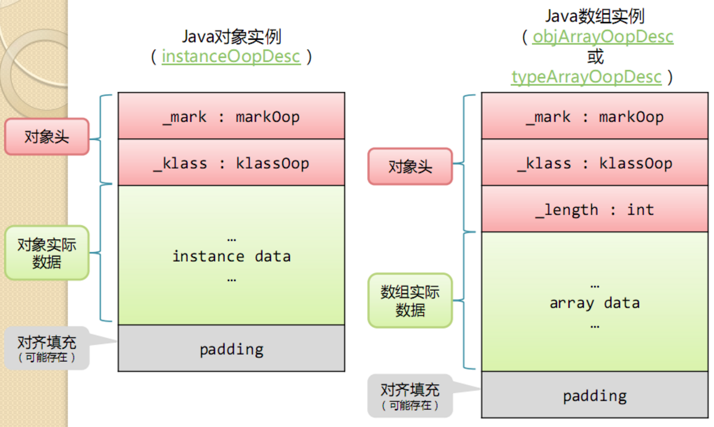
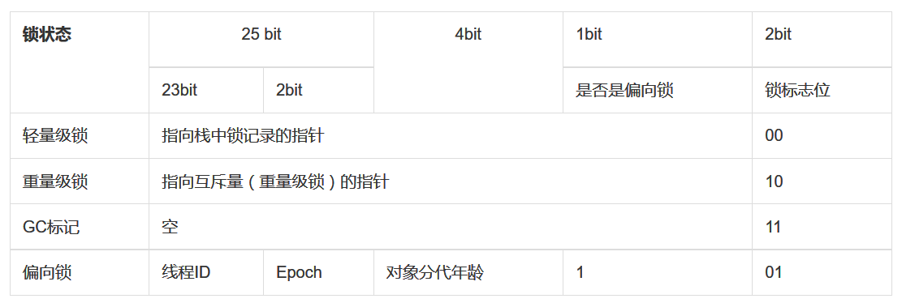
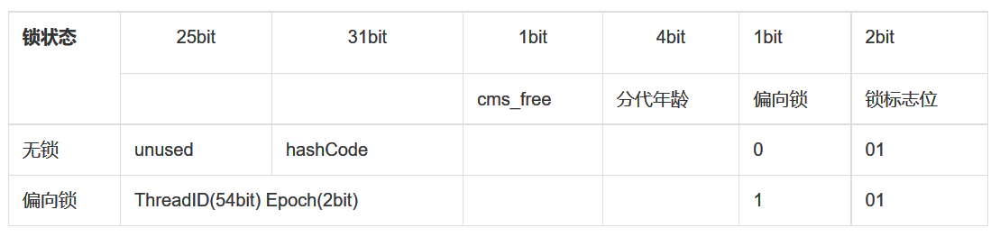

title: java内存区域与对象
date: 2016-07-04 19:01:56
categories: [java]
tags: [java,jdk]
---

# java内存区域与内存溢出

## java的内存区域
常规的认识中，java的内存区域分为堆和栈，这其实是个很泛的划分。

### 内存区域

* 堆内存：所有线程共享的区域，存放对象实例。
* 方法区（永久代、非堆内存）：所有线程共享此区域，存放已被虚拟机加载的类信息、常量、静态变量、即时编译器编译后的代码数据。在逻辑上属于堆内存一部分，但为了区别开，通常叫做Non-Heap(非堆)。永久代只是GC分代收集中的概念，并不等同于方法区，在jdk1.8之后，废弃了方法区，引入了元数据区（MetaSpace），此区域为直接内存，可自动扩容，避免了PermGen的溢出错误。
* 运行时常量池：属于方法区一部分。Class文件中除了类的模板、字段、方法、接口等描述信息外，还有一项信息是常量池信息。常量池用于存放编译期生成的各种字面量和符号的引用。运行期产生的常量也可以放入，典型的比如字符串常量。JDK1.7之后已经从方法区移除。
* 虚拟机栈：描述了java方法执行的内存模型。存储方法执行都会创建一个栈帧，用于存储局部变量表、操作数栈、动态链表，方法出口等信息，方法的调用到执行完毕对应栈帧的出栈和入栈。
* 本地方法栈：记录native方法的信息，具体信息根据虚拟机实现而定。
* 程序计数器：很小的内存空间，记录当前线程所执行的字节码指令地址。
* 直接内存：使用native函数库直接分配的堆外内存，大小不受java堆大小限制，只会受到物理机内存限制。

<!-- more -->
````
堆内存布局：分为年轻代和年老代，年轻代占1/3容量，年老代占2/3容量。
年轻代又分为Eden和2个survivor，eden占8/10，每个survivor占1/10。

年轻代中对象经过指定次数（默认15）的GC后存活，则转移到年老代中，通过 -XX:MaxTenuringThreshold指定。
如下情况对象会直接进入年老代：
1. 对象大小超过-XX:PretenureSizeThreshold设置的大小的直接进入年老代。
2. 如果Survivo空间中相同年龄的所有对象大小总和大于Survivor空间的一半，年龄大于该年龄的对象直接进入年老代。
````

### OutOfMemory

除了程序计数器，都会抛出，当创建对象时无法申请到空间时抛出。栈内存比较特殊，根据JVM的具体实现，当JVM对栈的实现是动态扩展的时候，如果扩展时无法申请到足够的内存时抛出。

### StackOverflowError

栈抛出，当线程请求的栈深度超过虚拟机所允许的深度时抛出。使用-Xss参数可控制栈内存容量。

# 对象
对象的创建过程：
1. 定位类符号引用，检查此符号代表的类已经被加载，解析和初始化过，如果没有，执行类加载过程。
2. 类加载检查通过后，为新对象分配内存。
3. 将对象分配的除对象头部分的内存空间都初始化为0。
4. 对对象进行必要的设置，包括：对象头信息填充，对象init方法的执行，将对象的属性值进行设置。

## 对象的内存布局
此处参考<https://segmentfault.com/a/1190000004574249>。      

对象在内存中分为3个区域：对象头，实例数据，对齐填充，前2个区域一定有，对齐填充是为了补齐，jvm要求对象地址必须是8byte的整数倍。

### 对象头
对象头分为，Mark Word，klass，如果是数组结构数据，还有一个数组长度。

> Mark Word

无论在32还是64系统，无论是否开启压缩，mark word都占一个位宽，即32位系统下为32bit，64位下为64bit。
在未锁定状态下，32位系统中：     
有25bit用于存储hashcode，4bit用于存储对象分代年龄，2bit存储锁标志位，1bit固定为0。
在64位系统下：        
31bit用于hashcode，4bit分代年龄，2bit锁标志位，1bit固定为0，未使用25bit。
32位系统在锁定状态时存储的内容：       


64位系统在锁定状态时存储的内容：


> Klass

类型指针，指向类。默认占一个位宽。64位系统下开启指针压缩，此部分占4byte，即变成32位下的大小。

> 数据长度

整型数据4byte。

对象头大小计算：    
32位：        
4byte(mark word)+4byte(klass)=8byte     
64位未压缩:     
8byte(mark word)+8byte(klass)=16byte    
开启压缩:       
8byte(mark word)+4byte(klass)=12byte    

数组，额外加4byte。

### 实例数据
|Primitive Type | Memory Required(bytes)|
| --- | :----: |
|boolean|1|
|byte|1|
|short|2|
|char|2|
|int|4|
|float|4|
|long|8|
|double|8|
|reference|32位4,64位8(开启压缩4)|
实例数据存储顺序受到虚拟机分配策略参数和源码中的定义顺序影响，默认分配存储顺序策略为：longs/doubles、ints、shorts/chars、bytes/booleans、oops(普通对象引用指针)，父类的变量定义为在子类前面，如果开启CompactFields参数为true，子类中较窄的变量也可能会插入到父类变量空隙中。

### 对齐填充
当前两部分的数据大小之和不是8byte的倍数时，则有此部分数据，补充为8byte的倍数。如果已经是8byte的数据，则这部分不存在。这部分数据没有意义。

## 对象的访问
对象访问有2种方式：句柄访问和指针访问。

### 句柄访问
对象的reference中存放句柄在句柄池中的地址，通过这个地址定位到句柄，句柄包含2部分内容：实例数据指针和对象类型指针。通过实例数据指针可以到实例池中获得指向的对象实例数据，通过对象类型指针可以得到对象类型数据。

### 指针访问
对象的reference中直接存储对象地址，此地址可以直接访问对象实例数据，实例数据中包含有指向对象类型的指针。

### 区别
使用句柄的好处是在对象被移动时只会改变句柄中的实例数据指针。reference不用修改。
使用指针的方式好处在速度更快，节省一次指针定位的时间。